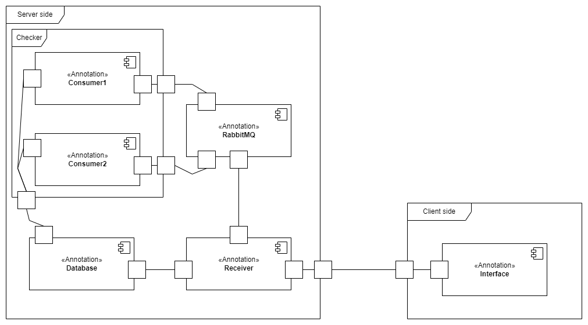
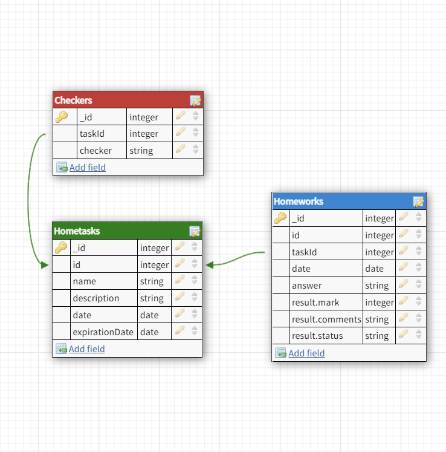

# SD-homeworks

## Deploy (on Linux OS)

1. Clone this repository
2. Open this project in Terminal
3. In Terminal run `docker-compose up -d`
4. Install NPM (Node package manager)
5. Goto /backend. Run `npm i` and `npm start`
6. Goto /backend2. Run `npm i` and `npm start`
7. Goto /frontend. Run `npm i` and `npm start`
8. Goto [localhost:3000](localhost:3000)

## Architecture

## Components Diagram

Приложение разделено на две основныее части: клиентскую и серверную.

### Client side

1. Interface - компонент, отвечающий за взаимодействие с пользователем и интерпретацию действий пользователя.

### Server side

1. Receiver - это комнонент, в котором происходит взаимодействие клиента с серверной частью приложения. Он отвечает на запросы пользователя, при необходимости, взаимодействуя с другими микросервисами
2. RabbitMQ - это Docker-контейнер, в который двумя очередями `tasks` и `checkers` посылаются запросы на проверку задания или регистрацию нового Checker-а
3. Consumer1 - компонент, отвечающий за обработку очереди `checkers`. Он добавляет  базу данных новый Checker, ассоциированный с определённым заданием.
4. Consumer2 - компонент, отвечающий за проверку задач. Внутри него могут одновременно работать несколько функций-обработчиков элементов очереди `tasks`.
5. Database - отвечает за хранение данных приложения. Подробнее об архитектуре базы данных можно прочитать далее.

### О Checker-ах

Изначально я предполагал, что Checker преподаватель пишет самостоятельно и загружает в систему. По сути, существует два варианта
1. функция-обработчик `(obj) => return {result: X, comments: "Y"}`, которую можно исполнить с помощью eval()
2. ссылка на github-репозиторий с определёнными правилами сборки и запуском

Я решил остановиться на первом варианте по нескольким причинам: это удобнее тестировать, в сжатые сроки написать второй вариант довольно проблематично, чем сложнее процесс - тем сложнее описать требования к нему.

### Схема базы данных

